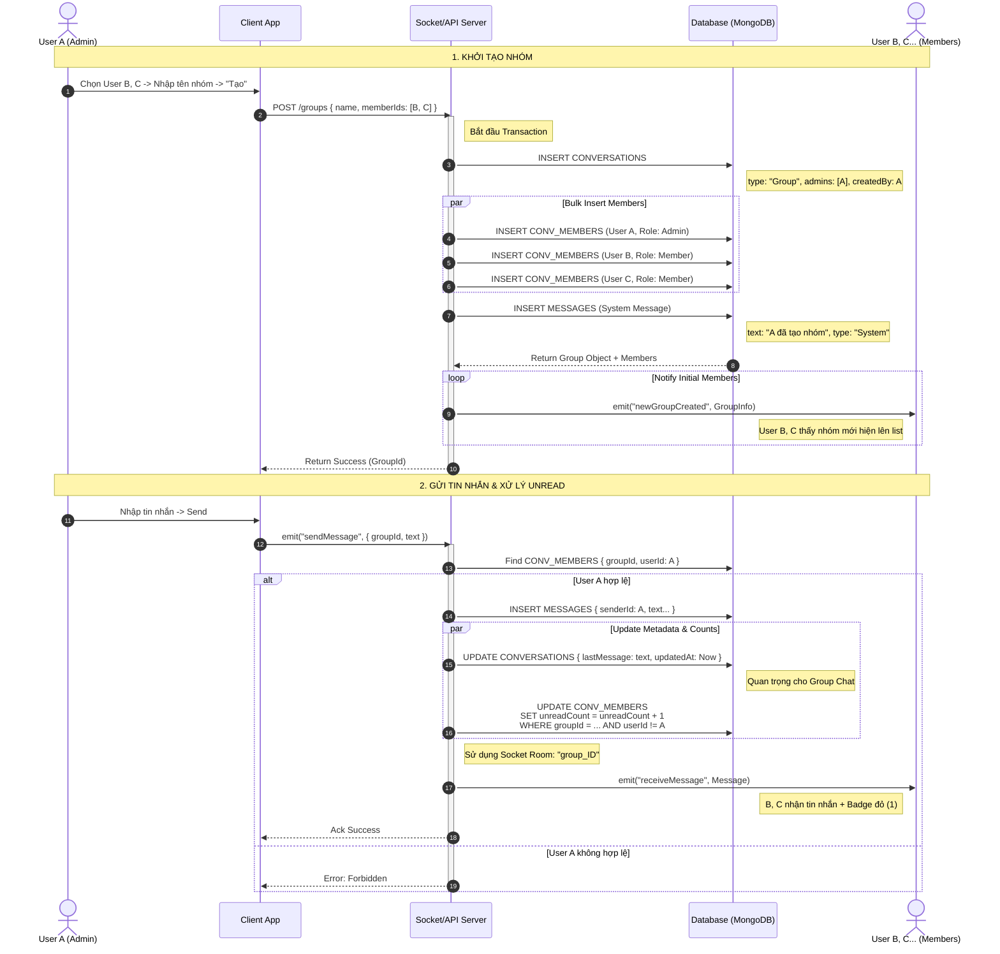

```mermaid
sequenceDiagram
    autonumber
    actor Admin as User A (Admin)
    participant Client as Client App
    participant Server as Socket/API Server
    participant DB as Database (MongoDB)
    actor Members as User B, C... (Members)

    %% PHẦN 1: TẠO NHÓM MỚI (CREATE GROUP)
    Note over Admin, Members: 1. KHỞI TẠO NHÓM
    Admin->>Client: Chọn User B, C -> Nhập tên nhóm -> "Tạo"
    Client->>Server: POST /groups { name, memberIds: [B, C] }
    activate Server

    %% Transaction tạo nhóm
    Note right of Server: Bắt đầu Transaction
    Server->>DB: INSERT CONVERSATIONS
    Note right of DB: type: "Group", admins: [A], createdBy: A

    par Bulk Insert Members
        Server->>DB: INSERT CONV_MEMBERS (User A, Role: Admin)
        Server->>DB: INSERT CONV_MEMBERS (User B, Role: Member)
        Server->>DB: INSERT CONV_MEMBERS (User C, Role: Member)
    end

    Server->>DB: INSERT MESSAGES (System Message)
    Note right of DB: text: "A đã tạo nhóm", type: "System"

    DB-->>Server: Return Group Object + Members

    %% Real-time Notification: Báo cho B và C biết có nhóm mới
    loop Notify Initial Members
        Server->>Members: emit("newGroupCreated", GroupInfo)
        Note left of Members: User B, C thấy nhóm mới hiện lên list
    end

    Server-->>Client: Return Success (GroupId)
    deactivate Server

    %% PHẦN 2: GỬI TIN NHẮN TRONG NHÓM
    Note over Admin, Members: 2. GỬI TIN NHẮN & XỬ LÝ UNREAD
    Admin->>Client: Nhập tin nhắn -> Send
    Client->>Server: emit("sendMessage", { groupId, text })
    activate Server

    %% Validate: Check xem A có còn trong nhóm không (đề phòng bị kick)
    Server->>DB: Find CONV_MEMBERS { groupId, userId: A }

    alt User A hợp lệ
        %% Lưu tin nhắn
        Server->>DB: INSERT MESSAGES { senderId: A, text... }

        par Update Metadata & Counts
            %% Update Preview bên ngoài
            Server->>DB: UPDATE CONVERSATIONS { lastMessage: text, updatedAt: Now }

            %% Tăng số tin chưa đọc cho TẤT CẢ thành viên trừ người gửi
            Note right of DB: Quan trọng cho Group Chat
            Server->>DB: UPDATE CONV_MEMBERS<br/>SET unreadCount = unreadCount + 1<br/>WHERE groupId = ... AND userId != A
        end

        %% Fan-out: Gửi socket cho những người trong phòng (Socket Room)
        Note right of Server: Sử dụng Socket Room: "group_ID"
        Server->>Members: emit("receiveMessage", Message)
        Note left of Members: B, C nhận tin nhắn + Badge đỏ (1)

        Server-->>Client: Ack Success
    else User A không hợp lệ
        Server-->>Client: Error: Forbidden
    end
    deactivate Server
```
