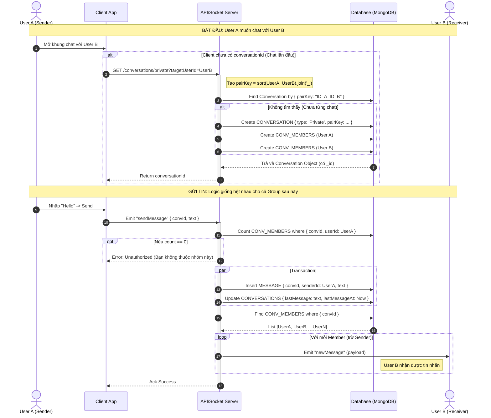

```mermaid
sequenceDiagram
    autonumber
    actor UserA as User A (Sender)
    participant Client as Client App
    participant API as API/Socket Server
    participant DB as Database (MongoDB)
    actor UserB as User B (Receiver)

    %% PHẦN 1: KHỞI TẠO HOẶC LẤY CONVERSATION ID
    %% Logic này giúp phân biệt Private vs Group nhưng trả về cùng 1 kết quả là ID
    Note over UserA, UserB: BẮT ĐẦU: User A muốn chat với User B

    UserA->>Client: Mở khung chat với User B

    alt Client chưa có conversationId (Chat lần đầu)
        Client->>API: GET /conversations/private?targetUserId=UserB
        activate API

        %% Tận dụng trường pairKey trong Schema để tìm nhanh O(1)
        Note right of API: Tạo pairKey = sort(UserA, UserB).join('_')
        API->>DB: Find Conversation by { pairKey: "ID_A_ID_B" }

        alt Không tìm thấy (Chưa từng chat)
            API->>DB: Create CONVERSATION { type: 'Private', pairKey: ... }
            API->>DB: Create CONV_MEMBERS (User A)
            API->>DB: Create CONV_MEMBERS (User B)
        end

        DB-->>API: Trả về Conversation Object (có _id)
        API-->>Client: Return conversationId
        deactivate API
    end

    %% PHẦN 2: GỬI TIN NHẮN (LOGIC CHUNG CHO CẢ PRIVATE & GROUP)
    %% Phần này không quan tâm là chat với 1 người hay nhiều người
    Note over UserA, UserB: GỬI TIN: Logic giống hệt nhau cho cả Group sau này

    UserA->>Client: Nhập "Hello" -> Send
    Client->>API: Emit "sendMessage" { convId, text }
    activate API

    %% 1. Validate quyền thành viên
    API->>DB: Count CONV_MEMBERS where { convId, userId: UserA }

    opt Nếu count == 0
        API-->>Client: Error: Unauthorized (Bạn không thuộc nhóm này)
    end

    %% 2. Lưu tin nhắn & Update Preview
    par Transaction
        API->>DB: Insert MESSAGE { convId, senderId: UserA, text }
        API->>DB: Update CONVERSATIONS { lastMessage: text, lastMessageAt: Now }
    end

    %% 3. FAN-OUT: Tìm người nhận (Mấu chốt của việc mở rộng)
    %% Thay vì hardcode gửi cho UserB, ta query lấy danh sách thành viên
    API->>DB: Find CONV_MEMBERS where { convId }
    DB-->>API: List [UserA, UserB, ...UserN]

    loop Với mỗi Member (trừ Sender)
        API->>UserB: Emit "newMessage" (payload)
        Note left of UserB: User B nhận được tin nhắn
    end

    API-->>Client: Ack Success
    deactivate API
```
