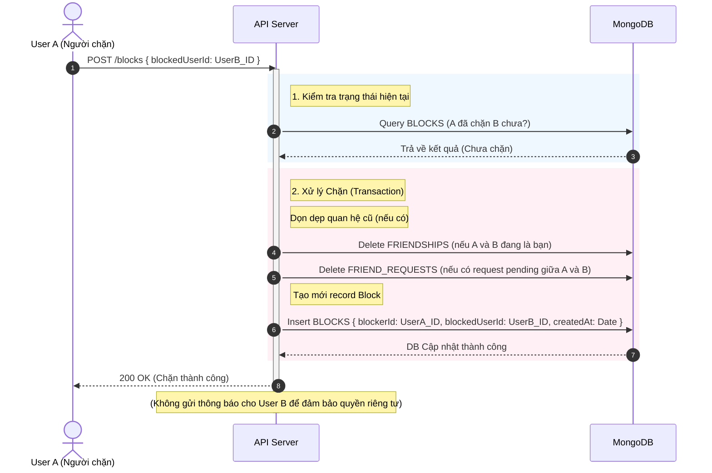
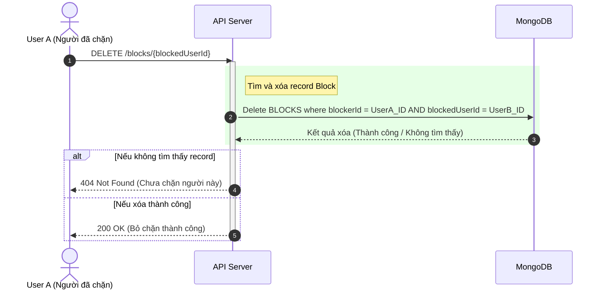

```mermaid
sequenceDiagram
    autonumber
    actor UserA as User A (Người chặn)
    participant API as API Server
    participant DB as MongoDB

    UserA->>API: POST /blocks { blockedUserId: UserB_ID }
    activate API

    %% Phase 1: Validation
    rect rgb(240, 248, 255)
        note right of API: 1. Kiểm tra trạng thái hiện tại
        API->>DB: Query BLOCKS (A đã chặn B chưa?)
        DB-->>API: Trả về kết quả (Chưa chặn)
    end

    %% Phase 2: Transaction / DB Update
    rect rgb(255, 240, 245)
        note right of API: 2. Xử lý Chặn (Transaction)

        note right of API: Dọn dẹp quan hệ cũ (nếu có)
        API->>DB: Delete FRIENDSHIPS (nếu A và B đang là bạn)
        API->>DB: Delete FRIEND_REQUESTS (nếu có request pending giữa A và B)

        note right of API: Tạo mới record Block
        API->>DB: Insert BLOCKS { blockerId: UserA_ID, blockedUserId: UserB_ID, createdAt: Date }
        DB-->>API: DB Cập nhật thành công
    end

    %% Phase 3: Response
    API-->>UserA: 200 OK (Chặn thành công)

    note over API: (Không gửi thông báo cho User B để đảm bảo quyền riêng tư)
    deactivate API
```

```mermaid
sequenceDiagram
    autonumber
    actor UserA as User A (Người đã chặn)
    participant API as API Server
    participant DB as MongoDB

    UserA->>API: DELETE /blocks/{blockedUserId}
    activate API

    %% Phase 1: Check & Delete
    rect rgb(230, 255, 230)
        note right of API: Tìm và xóa record Block
        API->>DB: Delete BLOCKS where blockerId = UserA_ID AND blockedUserId = UserB_ID
        DB-->>API: Kết quả xóa (Thành công / Không tìm thấy)
    end

    %% Phase 2: Response
    alt Nếu không tìm thấy record
        API-->>UserA: 404 Not Found (Chưa chặn người này)
    else Nếu xóa thành công
        API-->>UserA: 200 OK (Bỏ chặn thành công)
    end

    deactivate API
```
