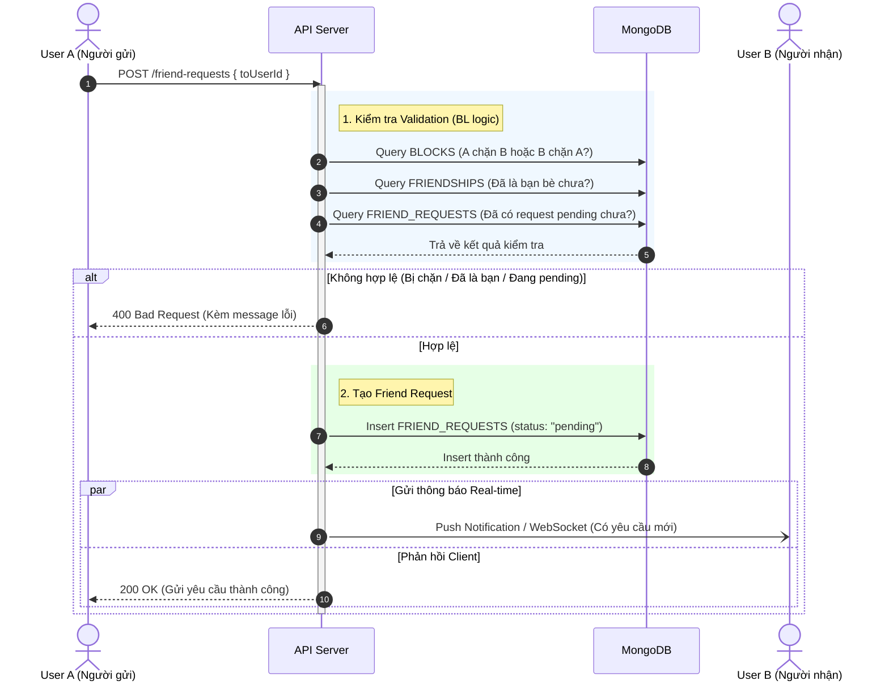
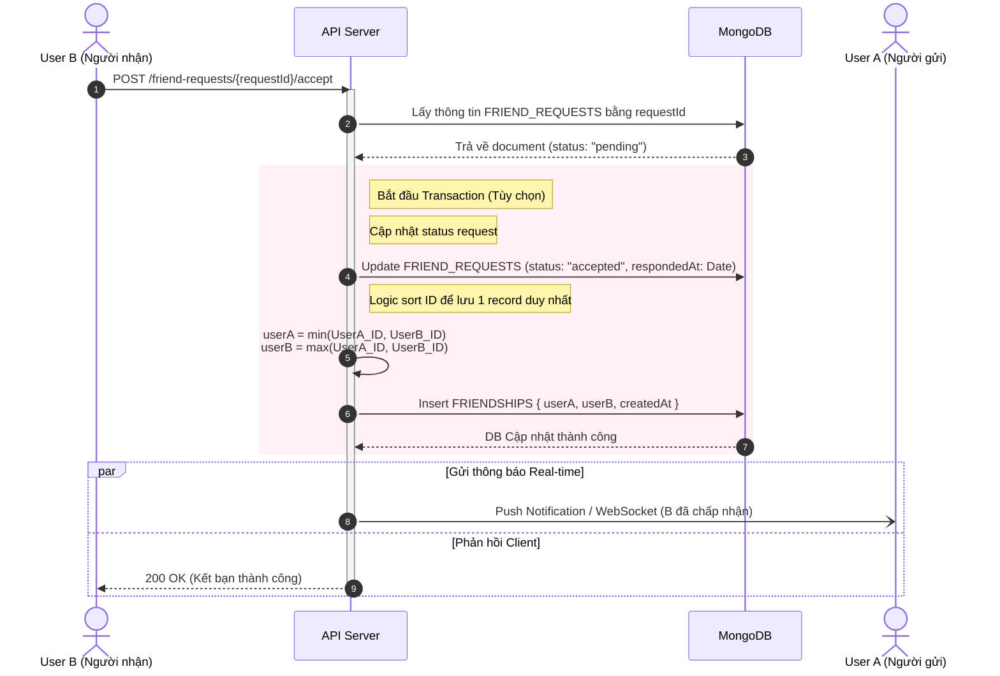

```mermaid
sequenceDiagram
    autonumber
    actor UserA as User A (Người gửi)
    participant API as API Server
    participant DB as MongoDB
    actor UserB as User B (Người nhận)

    UserA->>API: POST /friend-requests { toUserId }
    activate API

    %% Phase 1: Validation
    rect rgb(240, 248, 255)
        note right of API: 1. Kiểm tra Validation (BL logic)
        API->>DB: Query BLOCKS (A chặn B hoặc B chặn A?)
        API->>DB: Query FRIENDSHIPS (Đã là bạn bè chưa?)
        API->>DB: Query FRIEND_REQUESTS (Đã có request pending chưa?)
        DB-->>API: Trả về kết quả kiểm tra
    end

    alt Không hợp lệ (Bị chặn / Đã là bạn / Đang pending)
        API-->>UserA: 400 Bad Request (Kèm message lỗi)
    else Hợp lệ
        %% Phase 2: Insert Database
        rect rgb(230, 255, 230)
            note right of API: 2. Tạo Friend Request
            API->>DB: Insert FRIEND_REQUESTS (status: "pending")
            DB-->>API: Insert thành công
        end

        %% Phase 3: Response & Notification
        par Gửi thông báo Real-time
            API-)UserB: Push Notification / WebSocket (Có yêu cầu mới)
        and Phản hồi Client
            API-->>UserA: 200 OK (Gửi yêu cầu thành công)
        end
    end
    deactivate API
```

```mermaid
sequenceDiagram
    autonumber
    actor UserB as User B (Người nhận)
    participant API as API Server
    participant DB as MongoDB
    actor UserA as User A (Người gửi)

    UserB->>API: POST /friend-requests/{requestId}/accept
    activate API

    %% Phase 1: Check Request
    API->>DB: Lấy thông tin FRIEND_REQUESTS bằng requestId
    DB-->>API: Trả về document (status: "pending")

    %% Phase 2: Transaction / Update DB
    rect rgb(255, 240, 245)
        note right of API: Bắt đầu Transaction (Tùy chọn)

        note right of API: Cập nhật status request
        API->>DB: Update FRIEND_REQUESTS (status: "accepted", respondedAt: Date)

        note right of API: Logic sort ID để lưu 1 record duy nhất
        API->>API: userA = min(UserA_ID, UserB_ID)<br/>userB = max(UserA_ID, UserB_ID)

        API->>DB: Insert FRIENDSHIPS { userA, userB, createdAt }
        DB-->>API: DB Cập nhật thành công
    end

    %% Phase 3: Response & Notification
    par Gửi thông báo Real-time
        API-)UserA: Push Notification / WebSocket (B đã chấp nhận)
    and Phản hồi Client
        API-->>UserB: 200 OK (Kết bạn thành công)
    end
    deactivate API
```
