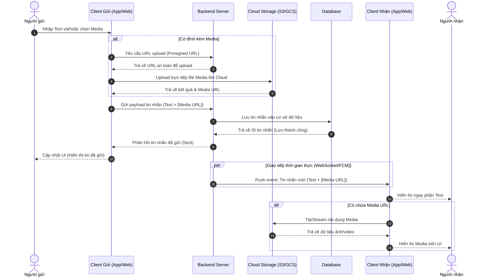

```mermaid
sequenceDiagram
    autonumber
    actor Sender as Người gửi
    participant AppA as Client Gửi (App/Web)
    participant API as Backend Server
    participant Storage as Cloud Storage (S3/GCS)
    participant DB as Database
    participant AppB as Client Nhận (App/Web)
    actor Receiver as Người nhận

    Sender->>AppA: Nhập Text và/hoặc chọn Media

    alt Có đính kèm Media
        AppA->>API: Yêu cầu URL upload (Presigned URL)
        API-->>AppA: Trả về URL an toàn để upload
        AppA->>Storage: Upload trực tiếp file Media lên Cloud
        Storage-->>AppA: Trả về kết quả & Media URL
    end

    AppA->>API: Gửi payload tin nhắn (Text + [Media URL])

    API->>DB: Lưu tin nhắn vào cơ sở dữ liệu
    DB-->>API: Trả về ID tin nhắn (Lưu thành công)
    API-->>AppA: Phản hồi tin nhắn đã gửi (Sent)
    AppA-->>Sender: Cập nhật UI (Hiển thị tin đã gửi)

    par Giao tiếp thời gian thực (WebSocket/FCM)
        API->>AppB: Push event: Tin nhắn mới (Text + [Media URL])
    end

    AppB-->>Receiver: Hiển thị ngay phần Text

    alt Có chứa Media URL
        AppB->>Storage: Tải/Stream nội dung Media
        Storage-->>AppB: Trả về dữ liệu ảnh/video
        AppB-->>Receiver: Hiển thị Media trên UI
    end
```
