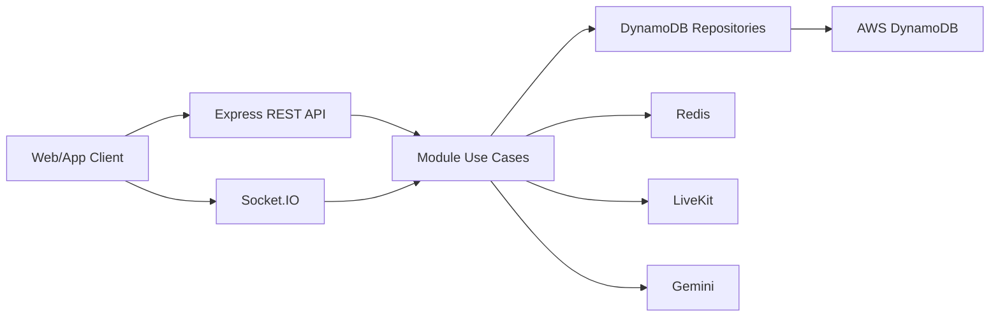
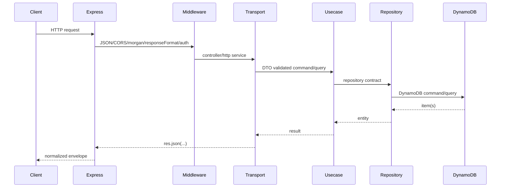

# Backend Architecture

## System Overview

ChatBE là backend Node.js/TypeScript dùng Express, DynamoDB, Redis và Socket.IO. Project không dùng NestJS, TypeORM hay MongoDB trong runtime hiện tại.

Runtime chính:

| Thành phần | Vai trò |
| --- | --- |
| Express | REST API v1/v2, middleware, Swagger UI |
| HTTP server | Server nền để gắn Express và Socket.IO |
| Socket.IO | Realtime chat, presence, social notifications, call notifications |
| DynamoDB | Database nghiệp vụ chính |
| Redis | Session, token blacklist, presence/socket state |
| AWS S3 hoặc compatible storage | Cloud media upload khi bật `CLOUD_STORAGE_ENABLED` |
| LiveKit | Audio/video call token và room |
| Google Gemini | AI summarize, smart reply, tone adjust, translate |
| Swagger YAML | API documentation source |

High-level dependency flow:



## Bootstrap Flow

Entrypoint: `src/index.ts`.

Startup sequence:

1. Load env bằng `dotenv.config()`.
2. Init Redis bằng `RedisClient.init(appConfig.redis.url)`.
3. Auto-init/sync DynamoDB tables bằng `initDynamoDBTables()`.
4. Tạo Express app và HTTP server.
5. Gắn JSON parser, `morgan`, static `/uploads`, CORS.
6. Dereference Swagger YAML và serve Swagger UI tại `/api-docs`.
7. Tạo Socket.IO server bằng `createSocketIOServer(httpServer)`.
8. Setup auth trước để lấy `authUseCase`, sau đó tạo `sctx.mdlFactory`.
9. Gắn `responseFormatMiddleware` cho `/v1` và `/v2`.
10. Setup từng module hexagon-ish và mount router.
11. Gắn global error handler `responseErr`.
12. Listen port từ `PORT` hoặc `3000`.

Nếu DynamoDB init fail, process exit với code `1` để tránh chạy backend trên schema thiếu.

## Folder Structure

Các folder chính:

```text
src/
  index.ts
  share/
    app-error.ts
    component/
    interface/
    middleware/
    model/
    repository/
    transport/
    utils/
  modules/
    auth/
    user/
    chat/
    media/
    blocks/
    friend-requests/
    friendships/
    my-cloud/
    search/
    call/
    ai/
docs/
  swagger/
  handoff/
  test-flows/
tests/
docker/
livekit/
```

Module structure phổ biến:

```text
src/modules/<feature>/
  index.ts                    # setup module, wire dependencies, expose router/service
  model/
    model.ts                  # domain model/enums/Zod schema
    dto.ts                    # request DTO/Zod validation
    errors.ts                 # domain errors
  interface/
    index.ts                  # ports/contracts
  usecase/
    *.ts                      # business logic
  infras/
    repository/dynamodb/      # DynamoDB implementation
    transport/                # HTTP/socket adapters
```

Một số module lớn như `chat` tách controller/socket/repository theo subdomain để tránh file quá lớn.

## Module Composition

Pattern hiện tại là "hexagon-ish":

- `index.ts` của module tạo repository, usecase, transport service/controller và router.
- `model` định nghĩa entity/DTO bằng Zod.
- `interface` định nghĩa contract cho usecase/repository.
- `usecase` chứa business logic, permission, validation nghiệp vụ.
- `infras/repository/dynamodb` triển khai persistence.
- `infras/transport` expose HTTP hoặc Socket.IO handler.

Ví dụ bootstrap module trong `src/index.ts`:

- `setupAuthHexagon(...)`
- `setupUserHexagon(...)`
- `setupMediaHexagon(...)`
- `setupMessagingHexagon(...)`
- `setupBlockHexagon(...)`
- `setupFriendRequestHexagon(...)`
- `setupFriendshipHexagon(...)`
- `setupMyCloudHexagon(...)`
- `setupSearchHexagon(...)`
- `setupCallHexagon(...)`
- `setupAiHexagon(...)`

`ServiceContext` truyền middleware factory chung, đặc biệt là auth middleware.

## HTTP Request Flow



Layer responsibilities:

| Layer | Nhiệm vụ |
| --- | --- |
| Middleware | Auth, response envelope, upload, role check |
| Transport | Parse request/params/query/body, call usecase, send response |
| Usecase | Business rules, permission, orchestration, side effects |
| Repository | DynamoDB key/index/access pattern, date mapping |
| Model/DTO | Zod validation, enum và entity shape |

## Response and Error Handling

`responseFormatMiddleware` normalize response dưới `/v1` và `/v2`:

- Success: `{ status: "success", msg, data?, meta? }`
- Error: `{ status: "error", msg, code, details? }`

`AppError` trong `src/share/app-error.ts` giữ HTTP status và details. Global error handler `responseErr` xử lý `AppError`, `ZodError` và unknown errors.

Một số controller legacy tự `res.status(...).json(...)`; miễn là route nằm dưới `/v1` hoặc `/v2`, middleware vẫn cố normalize về envelope chung.

## Authentication Architecture

Auth flow:

1. Client login/register gửi password và device headers.
2. `AuthUseCase` validate credential, hash bằng bcrypt và phát JWT.
3. Access token dùng `JWT_ACCESS_SECRET`, refresh token dùng `JWT_REFRESH_SECRET`; cả hai token mang `deviceId`, `jti` và `tokenVersion`.
4. Session/refresh state lưu trong Redis bằng `session:{deviceId}`, `user:sessions:{userId}`, `refresh:{jti}`, `refresh:used:{jti}` và `blacklist:{accessJti}`.
5. Refresh token rotate sau mỗi lần dùng; nếu refresh token consumed bị dùng lại, backend revoke session của device đó và phát `session:revoked`.
6. Logout/revoke đưa token/session vào blacklist/store.
7. `authMiddleware` introspect access token, kiểm tra blacklist/session/latest access JTI và đặt requester vào `res.locals.requester`.

Device management:

- `x-device-id` định danh thiết bị.
- `user-agent`, `x-display-label`, `x-device-platform`, `x-device-location` làm metadata session.
- `GET /v1/auth/sessions` trả danh sách session để user quản lý.
- Nghiệp vụ hiện tại giữ tối đa một session `web` và một session `app` cho mỗi user; login mới cùng platform sẽ revoke session cũ cùng platform.
- Web có thể dùng hybrid refresh cookie `chatbe_refresh_token` HttpOnly, còn app/FE vẫn nhận token trong JSON response để tương thích.

## DynamoDB Architecture

Database definitions nằm ở `src/share/repository/dynamodb/table-defs.ts`.

Repository base:

- `BaseQueryRepositoryDynamoDB`
- `BaseCommandRepositoryDynamoDB`
- `BaseRepositoryDynamoDB`

Table naming:

- Code dùng logical name trong `TABLE_NAMES`.
- Runtime name đi qua `getTableName`, có prefix `DYNAMODB_TABLE_PREFIX`.

Access pattern chính:

- Entity đơn giản: key `id`.
- Pair relationship: composite key như `userA/userB` hoặc `blockerId/blockedUserId`.
- Parent-child list: synthetic `pk/sk`, ví dụ `CONV#{conversationId}` + `MSG#{createdAt}#{messageId}`.
- Inbox: `conversation_members` dùng `userId-lastActivityAt-index`.
- Search media/link: `message_classifications` dùng `GSI1`.

Auto init:

- `initDynamoDBTables()` tạo table nếu thiếu.
- Code cũng sync GSI/TTL theo table definition.

## Redis Architecture

Redis client nằm trong `src/share/component/redis-pubsub/redis.ts`.

Redis dùng cho:

- Auth refresh/session store.
- Token blacklist.
- Presence online/offline, socket heartbeat và last seen sync.
- Runtime pub/sub hoặc socket state phụ trợ.

Docker local/prod chạy Redis cùng network với backend. Local có thể publish port ra host để backend chạy bằng `npm start` vẫn kết nối được.

## Socket.IO Architecture

Socket.IO server được tạo bởi `createSocketIOServer(httpServer)`.

Các phần chính:

- Global socket component: auth handshake, connected/ping/pong, subscribe/unsubscribe conversation, basic presence.
- Chat socket service: handlers trong `src/modules/chat/infras/transport/socket`.
- User socket service: heartbeat/presence.
- Friend request/block socket services: social notifications.
- Call socket services: call namespace/events.

Room/key convention phổ biến:

- User room: `user:{userId}`.
- Conversation/group room: theo conversation/group id tùy service.
- Call room: `call:{callId}`.

Socket event source:

- `src/modules/chat/constants/socket-events.ts`
- `docs/SOCKET_EVENTS_V2_REFERENCE.md`
- `docs/CHAT_API_SOCKET_REFERENCE.md`

## Chat Architecture

Chat là module lớn nhất, gồm:

- Conversation usecases: private/group creation, listing, mute/pin/archive, shared conversations.
- Message usecases: send, edit, delete, revoke, forward, quote, read/delivered, search.
- Group usecases: members, owner/admin, pending approval, settings.
- Utilities: poll, reminder, note.
- V2 usecases/controllers cho stranger conversations, message requests, hidden chat, profile cards.

Persistence split:

- `conversations`: metadata.
- `conversation_members`: member/inbox state.
- `messages`: timeline.
- `message_reactions`: reactions.
- `message_classifications`: media/link search.
- `polls`, `group_reminders`, `group_notes`: group utilities.

Realtime side effects phát qua `MessagingSocketService` sau khi usecase cập nhật data.

## Media and My Cloud Architecture

Media module xử lý:

- Upload qua backend local/cloud storage.
- Request presigned URL.
- Confirm upload.
- Delete media.

My Cloud module xử lý:

- File/image/video/voice/link/note cá nhân.
- Trash/restore/permanent delete.
- Pin/share/forward.
- Collections và collection-item mapping.

Khi cloud storage bật, env cần có `CLOUD_BUCKET_NAME`, `CLOUD_REGION`, `CLOUD_ACCESS_KEY_ID`, `CLOUD_SECRET_ACCESS_KEY`.

## Call Architecture

Call module có hai nhánh:

- Legacy v1 self-hosted LiveKit: `/v1/calls`.
- V2/cloud flow: `/v1/calls/v2` và `/v2/calls`.

`LivekitService` phát token dựa trên provider:

- Self-hosted: `LIVEKIT_API_KEY`, `LIVEKIT_API_SECRET`, `LIVEKIT_WS_URL`.
- Cloud: `LIVEKIT_CLOUD_API_KEY`, `LIVEKIT_CLOUD_API_SECRET`, `LIVEKIT_CLOUD_WS_URL`.

Call session hiện là runtime memory service. Khi call kết thúc, call log service có thể ghi message type `call` vào chat.

## AI Architecture

AI module expose `/v1/ai/*` và được mount với auth middleware.

Usecases:

- Summarization.
- Smart reply.
- Tone adjustment.
- Translation.
- Language detection.

Provider hiện tại là Google Gemini, cấu hình qua:

- `GEMINI_API_KEY`
- `GEMINI_MODEL`
- `AI_MAX_TOKENS`
- `AI_TEMPERATURE`

## Configuration

Config loader: `src/share/component/config.ts`.

Env groups:

| Group | Variables |
| --- | --- |
| App | `NODE_ENV`, `PORT`, `APP_URL`, `FRONTEND_URL`, `CORS_ORIGINS` |
| DynamoDB | `DYNAMODB_REGION`, `DYNAMODB_ENDPOINT`, `DYNAMODB_TABLE_PREFIX`, `AWS_ACCESS_KEY_ID`, `AWS_SECRET_ACCESS_KEY` |
| Redis | `REDIS_HOST`, `REDIS_URL`, `REDIS_PORT`, `REDIS_PASSWORD` |
| JWT/Auth | `JWT_ACCESS_SECRET`, `JWT_ACCESS_EXPIRES_IN`, `JWT_REFRESH_SECRET`, `JWT_REFRESH_EXPIRES_IN`, `AUTH_REQUIRE_EMAIL_VERIFICATION`, `AUTH_REFRESH_COOKIE_ENABLED`, `AUTH_REFRESH_COOKIE_NAME`, `AUTH_REFRESH_COOKIE_SAMESITE`, `AUTH_REFRESH_COOKIE_SECURE` |
| Password reset | `JWT_PASSWORD_RESET_SECRET`, `JWT_PASSWORD_RESET_EXPIRES_IN` |
| Email | `SMTP_HOST`, `SMTP_PORT`, `SMTP_SECURE`, `SMTP_USER`, `SMTP_PASS`, `EMAIL_FROM`, `EMAIL_FROM_NAME` |
| Upload | `UPLOAD_MAX_FILE_SIZE`, `UPLOAD_DESTINATION`, `UPLOAD_BASE_URL`, `UPLOAD_ALLOWED_MIME_TYPES` |
| Cloud storage | `CLOUD_STORAGE_ENABLED`, `CLOUD_STORAGE_PROVIDER`, `CLOUD_BUCKET_NAME`, `CLOUD_REGION`, `CLOUD_ACCESS_KEY_ID`, `CLOUD_SECRET_ACCESS_KEY` |
| AI | `GEMINI_API_KEY`, `GEMINI_MODEL`, `AI_MAX_TOKENS`, `AI_TEMPERATURE` |
| LiveKit | `LIVEKIT_API_KEY`, `LIVEKIT_API_SECRET`, `LIVEKIT_WS_URL`, `LIVEKIT_CLOUD_API_KEY`, `LIVEKIT_CLOUD_API_SECRET`, `LIVEKIT_CLOUD_WS_URL` |

Template files:

- `.env.example`: chạy host dev.
- `.env.local.example`: Docker local.
- `.env.production.example`: Docker production.

## Deployment Runtime

Docker files:

- `Dockerfile`: backend image.
- `docker-compose.yml`: Redis base service/network/volume.
- `docker-compose.local.yml`: local overrides.
- `docker-compose.prod.yml`: production backend + Redis.

Scripts:

```bash
npm run start
npm run demo
npm run docker:local
npm run docker:prod
npm run docker:logs
npm run docker:down
npm run dynamodb:init
npm run dynamodb:reset
npm run test
```

Production notes:

- Đặt reverse proxy/TLS phía trước backend.
- Redis production không nên expose ra host public.
- Không commit `.env`, secret hoặc credential thật.
- Nếu dùng AWS DynamoDB thật, để `DYNAMODB_ENDPOINT` rỗng.

## Testing Architecture

Test config:

- `jest.config.ts`
- `tsconfig.test.json`

Test folders:

- `tests/*.test.ts`: service/e2e/live e2e scenarios.
- `tests/helpers/*`: harness, server, socket, seed, repositories.
- `docs/test-flows/*`: mô tả test flow tương ứng.

Các nhóm test hiện có:

- Auth session/device.
- Social privacy/profile/presence.
- Chat v2 behavior.
- Chat search.
- Group utilities.
- Advanced messages.
- Call v2 service.
